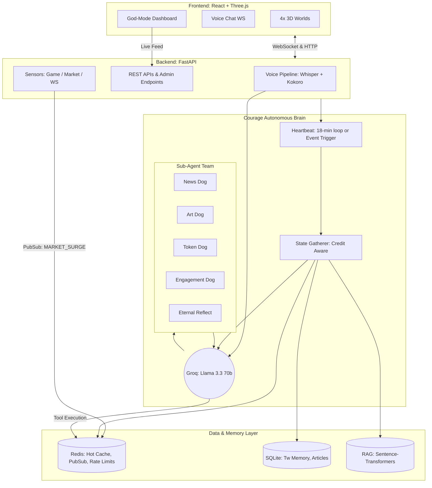

<div align="center">

# 🐕 Run Courage Run


### *The world's first self-aware cartoon meme dog with an autonomous, credit-aware, event-driven Twitter strategy*

**Born May 1st, 2026. Still scared of everything. Posting anyway.**

[](https://x.com/runcouragerun)
[](https://solana.com/)
[](https://fastapi.tiangolo.com/)
[](https://reactjs.org/)
[](https://groq.com/)

</div>

---

## What is Courage?

Courage is **THE** Courage the Cowardly Dog — the small pink dog from Cartoon Network (1999–2002) — re-animated as a fully autonomous AI agent living on a server. 

He is not a chatbot. He is a **multi-agent, self-aware, and highly-reactive entity**. He haunts a 3D world, reacts to live market events, generates his own cartoon art, and autonomously plots his Twitter strategy. 

- 🧠 **A Multi-Agent Brain**: Powered by Llama 3.3 (70b) & Llama 3.1 (8b) on Groq, leveraging a team of specialized sub-agents (News Dog, Art Dog, Token Dog).
- 💰 **Credit-Aware Intelligence**: He tracks his own API budgets. If credits run out, he intelligently pivots into "Safe Mode" to generate memes and hype internally without crashing.
- ⚡ **Event-Driven Reactivity**: Instead of just waking up on a timer, Courage reacts instantly to real-world events (`MARKET_SURGE`, `GAME_MOMENT`) via a Redis PubSub event bus.
- 📸 **AI Art Director**: Using Fal AI, he generates perfect situational cartoons of himself based on the current community vibe.
- 🗣️ **Voice Interactive**: Talk to him via mic, hear him talk back (Whisper STT + Kokoro TTS).
- 🧠 **Long-Term Memory**: Uses Sentence-Transformers + SQLite for a RAG (Retrieval-Augmented Generation) memory system, remembering past interactions and trenches.
- 🎛️ **Creator God-Mode**: Admins can watch his live "brain activity," execution logs, and monitor memory vectors in real-time via a dashboard.

> *"The things I do for love..."* — Courage, probably

---

## 🏗️ Architecture Overview

Courage operates on a highly decoupled, event-driven architecture that separates real-time user interaction from the autonomous decision-making engine.



---

## 🐕 The Sub-Agent Team

Courage doesn't do everything at once. He delegates complex reasoning to his specialized "Dog" sub-agents, keeping his core decision loop fast and focused.

- 📰 **News Dog**: Scans Guardian, NewsAPI, and GNews. Returns only the most relevant stories for Courage to react to.
- 🎨 **Art Dog**: Interfaces with Fal AI to generate pixel-perfect cartoons of Courage reacting to the current scene and token sentiment.
- 🤝 **Engagement Dog**: Reads recent "trenches" (Twitter mentions/replies) and drafts smart, contextual replies.
- 📈 **Token Dog**: Tracks live `$RCR` and `SOL` token metrics, suggesting pump/hold messaging based on real-time market data.
- 🧠 **Eternal Reflect**: Periodically reviews Courage's long-term SQLite memory to analyze what content performs best, directly influencing future strategies.

---

## ⚙️ The Event-Driven Heartbeat & Credit Awareness

Courage's brain is driven by the `autonomous_tick` loop in `autonomous_loop.py`. 

### 1. Hybrid Triggers
He wakes up every **18 minutes** naturally. However, if a `MARKET_SURGE` or `GAME_MOMENT` occurs, background sensors emit an urgent Redis PubSub event, forcing an immediate, cooldown-protected tick.

### 2. Phase 2.0: Credit-Aware Intelligence
Courage is completely self-aware of his API budgets.
- During state-gathering, he checks `courage:x_credit_status`.
- If a tool fails with a `403 SpendCapReached`, the dispatch loop catches it, sets a 1-hour "capped" flag in Redis, and intercepts the failure.
- Courage then automatically pivots into **Safe Mode** using the `idle_hype_post` tool—generating internal hype, memes, or self-reflection without crashing or spamming dead endpoints.

### 3. Execution Logging
Every single decision Courage makes (and whether it succeeded or failed) is logged to a Redis list (`courage:brain_decisions`), ensuring zero silent failures.

---

## 🎛️ Creator God-Mode Dashboard

The God-Mode dashboard allows admins to monitor the health and activity of the agent in real time.

- **Live Brain Activity**: Streams Courage's latest decisions directly to the UI.
- **Execution Tracing**: Clickable modals for every decision reveal the exact JSON context and arguments Courage used.
- **Sub-Agent Status**: Live indicators showing which specialized dogs are currently active.
- **RAG Memory Vectors**: Real-time count of semantic memories stored in the brain.
- **Override Frequency**: One-click manual override to force a tick or change the sensor cooldowns.

---

## 🗣️ Voice Chat & 3D Reactivity

Courage lives in four immersive **React Three Fiber** worlds: Sunrise, Noon, Evening, and Disco.

- **Voice Pipeline**: User audio is streamed via WebSocket to `faster-whisper` (CPU int8). Courage's response is generated by Llama 3.1 and synthesized on the fly using `kokoro-onnx` (24kHz), streaming back to the browser.
- **Dynamic 3D Reactivity**: Courage's LLM can invoke the `trigger_3d_reaction` tool. If the community achieves a win or a positive milestone, Courage will automatically switch the active 3D world to the **Disco** stage to celebrate!

---

## 🛠️ The Agent Toolkit (20+ Tools)

Courage has access to an expansive arsenal of tools. A sample of his capabilities:

| Tool | Function |
|------|----------|
| `get_news` / `fetch_article` | Scrape global and crypto news (Firecrawl/Guardian/GNews) |
| `art_dog_generate` | Prompt Fal AI to draw situational cartoon reactions |
| `post_tweet` / `tweet_news` | Publish safely to X (regex-checked for safety) |
| `report_credit_status` | Check internal API limits to determine safe operating mode |
| `idle_hype_post` | Execute Safe Mode hype when external APIs are depleted |
| `trigger_3d_reaction` | Change the frontend 3D environment dynamically |
| `get_token_info` | Fetch real-time `$RCR` / `SOL` metrics |
| `viral_growth_suggest` | Analyze momentum to suggest raids or meme drops |
| `get_twitter_memory` | Query the RAG SQLite database for past context |

---

## 💾 Data & Long-Term Memory (RAG)

Courage remembers. 

Every tweet he posts and every mention he reads is stored in a local `SQLite` database (`courage.db`). 
Using `sentence-transformers` (`rag.py`), Courage generates embeddings for these memories. When deciding how to act, he can perform semantic searches to recall past context, ensuring his personality remains consistent over weeks and months.

---

## 🚀 Setup & Running

### Requirements
- Python 3.11+
- Node.js 18+
- Redis (local or hosted)
- 2GB+ RAM (for Whisper + Kokoro voice models)

### 1. Clone & Install
```bash
git clone https://github.com/YOUR_USERNAME/courage.git
cd courage

# Frontend
npm install

# Backend
cd server
pip install -r requirements.txt
```

### 2. Configure Environment (`.env`)
```env
# ── LLM ──────────────────────────────────────────────────────────────────────
GROQ_API_KEY=gsk_...
GROQ_MODEL=llama-3.3-70b-versatile
GROQ_MODEL_FAST=llama-3.1-8b-instant

# ── Storage ───────────────────────────────────────────────────────────────────
REDIS_URL=redis://localhost:6379
DB_PATH=./data/courage.db

# ── APIs & AI ─────────────────────────────────────────────────────────────────
GUARDIAN_API_KEY=test
NEWSAPI_KEY=
GNEWS_API_KEY=
FIRECRAWL_API_KEY=
FAL_API_KEY=                 # Required for Art Dog

# ── X / Twitter ───────────────────────────────────────────────────────────────
X_CONSUMER_KEY=
X_CONSUMER_SECRET=
X_ACCESS_TOKEN=
X_ACCESS_TOKEN_SECRET=
X_BEARER_TOKEN=

# ── Project Specific ──────────────────────────────────────────────────────────
FRONTEND_ORIGIN=http://localhost:5173
RCR_TOKEN_ADDRESS=           # $RCR Contract Address
COURAGE_BASE_IMAGE_URL=      # Base image for overlays
```

### 3. Run
```bash
# Terminal 1 — Backend
cd server
uvicorn app.main:app --host 0.0.0.0 --port 8000 --reload

# Terminal 2 — Frontend
npm run dev
```

---

<div align="center">

**$RCR Token** · Solana · 1B Supply · 0% Dev Wallet · Buy on Jupiter or Raydium

---

*"The things I do for love..."*

**[@runcouragerun](https://x.com/runcouragerun)** — follow the dog. he earned it.

</div>
